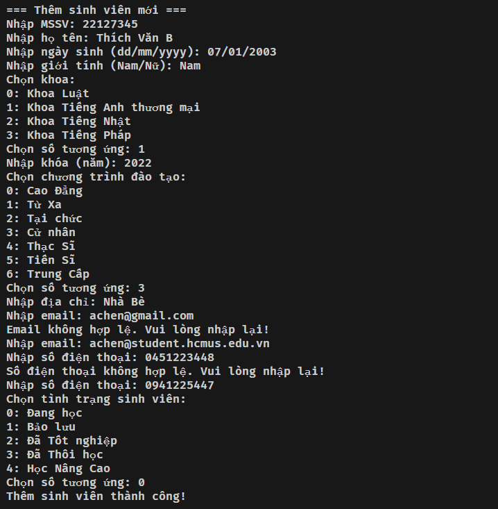
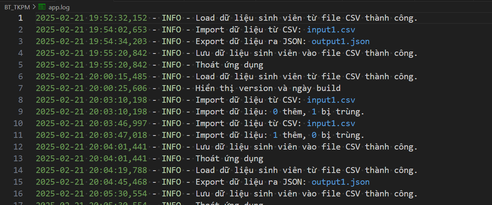
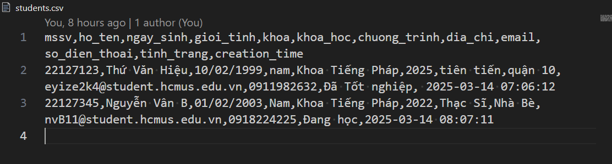

<!-- 1. Chương trình sử dụng ngôn ngữ C++ và giao diện console. 
Khi mới khởi động chương trình

Chức năng thêm thông tin sinh viên mới

Chức năng cập nhật thông tin cho sinh viên

Chức năng tìm kiếm sinh viên 

Chức năng hiển thị danh sách sinh viên

Chức năng xóa sinh viên khỏi danh sách

1. Cấu trúc chương trình: 
- Chương trình áp dụng **singleton pattern**, với class **studentManager** có một và chỉ một instance để quản lí các sinh viên và thực hiện các thao tác chính của chương trình.
- Trong file **main.cpp** thực hiện tạo một menu hướng dẫn cho người dùng trong console.
- Trong file **student.h** định nghĩa một struct là student, dùng để đại diện cho các thông tin của một sinh viên.
- Trong file **student.cpp** implement hàm display() dùng để in thông tin của một sinh viên.
- Trong file **student_manger.h** định nghĩa một class studentManger, class này quản lí các thao tác của chương trình và chứa 1 trường dữ liệu static là students, dùng để lưu trữ thông tin của các student trong chương trình.
- Trong file **student_manager.cpp** implement các phương thức (method) của class studentManager trong file student_manager.h, đồng thời implement 1 số hàm phụ.
1. Nếu chưa cài đặt compiler cho C++, vui lòng đọc tài liệu ở đường dẫn sau: https://code.visualstudio.com/docs/languages/cpp 
2. Để compile code, cần mở terminal tại đường dẫn nơi thư mục main.cpp và chạy câu lệnh sau: "g++ *.cpp"
3. Để chạy chương trình, tiếp tục gõ: ".\a" -->
# Quản Lý Danh Sách Sinh Viên

## Giới Thiệu
Chương trình sử dụng python và giao diện console. **Đầy đủ các tính năng trong yêu cầu của Ex1 và Ex2** gồm: 

**Version v1.0**
1. **Thêm sinh viên mới**: Nhập thông tin của một sinh viên và lưu vào danh sách.
   - Chọn mục "Thêm sinh viên".
   - Nhập đầy đủ thông tin sinh viên (MSSV, Họ tên, Ngày sinh, Giới tính, v.v.), nếu trường thông tin đó không hợp lệ, sẽ cần nhập lại đến hợp lệ.
   - Sinh viên sẽ được thêm vào danh sách nếu MSSV không bị trùng.
   
2. **Xóa sinh viên**: Xóa thông tin sinh viên dựa trên Mã số sinh viên (MSSV).
   - Chọn mục "Xóa sinh viên".
   - Nhập MSSV của sinh viên cần xóa.
   - Nếu MSSV tồn tại, sinh viên sẽ bị xóa khỏi danh sách.
   
3. **Cập nhật thông tin sinh viên**: Cập nhật thông tin của sinh viên dựa trên MSSV.
   - Chọn mục "Cập nhật thông tin sinh viên".
   - Nhập MSSV của sinh viên cần cập nhật.
   - Nếu sinh viên tồn tại, chọn trường thông tin cần cập nhật và nhập giá trị mới (các giá trị đều được validate).
   
4. **Tìm kiếm sinh viên**: Tìm kiếm sinh viên theo họ tên hoặc MSSV.
   - Chọn mục "Tìm kiếm sinh viên".
   - Chọn phương thức tìm kiếm theo MSSV hoặc Họ tên và nhập từ khóa.
   - Kết quả sẽ được hiển thị ngay trên màn hình.
   

**Version v2.0**

✅ **Lưu trữ dữ liệu:**

- Sử dụng **XML, JSON, CSV, Database**, hoặc hình thức lưu trữ khác (**chọn ít nhất một**) => Lưu vào file csv.

✅ **Cho phép đổi tên & thêm mới:**

- **Khoa (Faculty)**
- **Tình trạng sinh viên (Student Status)**
- **Chương trình đào tạo (Program)**

✅ **Thêm chức năng tìm kiếm:**

- **Tìm theo khoa**
   - Chọn mục "Tìm kiếm theo Khoa".
   - Chọn khoa từ danh mục có sẵn.
   - Chương trình hiển thị danh sách sinh viên thuộc khoa được chọn.
   
- **Tìm theo khoa + tên sinh viên**
   - Chọn mục "Tìm kiếm theo Khoa và Tên sinh viên".
   - Chọn khoa từ danh mục và nhập tên sinh viên cần tìm.
   - Hiển thị danh sách sinh viên phù hợp với tiêu chí tìm kiếm.
   
✅ **Hỗ trợ import/export dữ liệu:**

- **CSV, JSON, XML, Excel** (**chọn ít nhất 2**)
=> **Import** dùng **CSV + JSON**, **Export** dùng **JSON**. Lí do **Export** chỉ có JSON là vì khi lưu trữ dữ liệu chương trình đã dùng file **CSV** rồi.
   - Chọn mục "Import dữ liệu".
   - Chọn định dạng file cần import (CSV hoặc JSON) và nhập đường dẫn file.
   - Với mỗi sinh viên được import, chương trình sẽ kiểm tra MSSV. Nếu MSSV đã tồn tại trong danh sách hiện có, sinh viên đó sẽ không được thêm vào.
   - Kết quả import sẽ thông báo số lượng sinh viên được thêm và số lượng bị bỏ qua.
   
   - Chọn mục "Export dữ liệu ra JSON".
   - Nhập đường dẫn file JSON để lưu dữ liệu.
   - Chương trình xuất toàn bộ danh sách sinh viên hiện có ra file JSON.
   
   

✅ **Thêm logging mechanism:**

- Ghi lại logs để **troubleshooting production issues & audit purposes**.
    - Mọi hành động chính (thêm, xóa, cập nhật, import, export, hiển thị version) được ghi lại vào file `app.log` nhằm phục vụ troubleshooting và audit.
    - File `app.log` được tạo trong cùng thư mục chứa source code.  
    

✅ **Thêm chức năng show version và ngày build ứng dụng**
    - Chọn mục "Hiển thị version và ngày build".
    - Thông tin phiên bản và ngày build của ứng dụng sẽ được hiển thị trên màn hình.
    
**Version v3.0:** 
1.  MSSV phải là duy nhất  
   - Khi thêm hoặc cập nhật sinh viên, không được trùng MSSV với sinh viên khác.  


2.  Email phải thuộc một tên miền nhất định và có thể cấu hình động (configurable) 
   - Ví dụ: Chỉ chấp nhận email có đuôi `@student.university.edu.vn`.
Khi nhập không đúng định dạng mail:  

Những định dạng mail cho phép (có thể sửa được):

3.  Số điện thoại phải có định dạng hợp lệ theo quốc gia (configurable) 
   - Ví dụ: Việt Nam (`+84` hoặc `0[3|5|7|8|9]xxxxxxxx`).  	
Khi nhập số điện thoại không đúng định dạng:	 

Những định dạng số điện thoại (regex) cho phép (có thể sửa được):

4.  Tình trạng sinh viên chỉ có thể thay đổi theo một số quy tắc (configurable)
   - Ví dụ:  
     - `"Đang học"` → `"Bảo lưu"`, `"Tốt nghiệp"`, `"Đình chỉ"` (hợp lệ).  
     - `"Đã tốt nghiệp"` không thể quay lại `"Đang học"`.
Khi chọn thay đổi tình trạng không cho phép:	 

Thông tin các tình trạng và các quy tắc trong file configurable:


**Version v4.0:**

06. Chỉ được phép xóa sinh viên có creation date/time trong khoảng thời gian nhất định. Ví dụ: 30 phút (configurable) 


07. Cho phép bật / tắt việc áp dụng các quy định 



08. Các màn hình cần hiện logo hoặc tên Trường (ít nhất một) => Tên trường


09. Cho phép xóa khoa, xóa tình trạng sinh viên, xóa chương trình đào tạo nếu không có ràng buộc về dữ liệu 


10. Xuất giấy xác nhận tình trạng sinh viên ra **HTML/MD/PDF/DOCX** (ít nhất 2 định dạng) => là **HTML** và **MD**

File HTML

File MarkDown

## Cấu Trúc Source Code
- **validators.py**: Chứa các hàm kiểm tra tính hợp lệ của dữ liệu (email, số điện thoại, ngày sinh, v.v.).
- **student_manager.py**: Chứa toàn bộ logic của chương trình, bao gồm:
  - Các chức năng quản lý sinh viên (thêm, xóa, cập nhật, tìm kiếm).
  - Quản lý danh mục (Khoa, Tình trạng sinh viên, Chương trình đào tạo).
  - Import/Export dữ liệu.
  - Logging và hiển thị version.
- **students.csv**: File lưu trữ dữ liệu sinh viên (được tạo và cập nhật tự động).
- **app.log**: File ghi log các hành động và lỗi trong quá trình chạy chương trình.
- **input1.csv**: File dữ liệu csv mẫu để import dữ liệu
- **input1.json**: File dữ liệu json mẫu để import dữ liệu
- **allowed_email_domains**: File configurable các domain email hợp lệ
- **allowed_phone_patterns**: File configurable các số điện thoại hợp lệ
- **allowed_status_transitions**: File configurable các tình trạng sinh viên hợp lệ
- **build_info.txt**: chứa thông tin lần build gần nhất của app.
- **overall_config.txt**: chứa các thông tin cần config của 1 số chức năng
- **allowed_programs**: Thông tin các chương trình (cử nhân/thạc sĩ/tiến sĩ)
- **allowed_faculties**: Thông tin các khoa tồn tại.

## Yêu Cầu Cài Đặt
- **Python 3.12.2**  
- Sử dụng các thư viện: `csv`, `json`, `logging`, `os`, `datetime`, `subprocess`

## Hướng Dẫn Cài Đặt và Chạy Chương Trình

1. **Download/Clone Source Code**
   - Tải source code về và giải nén hoặc dùng git clone.

2. **Chạy Chương Trình**
   - Mở terminal (hoặc CMD) và chuyển đến thư mục chứa file `app.py`.
   - Chạy lệnh sau:
     ```bash
     python app.py
     ```
   - Menu chính của chương trình sẽ được hiển thị.
